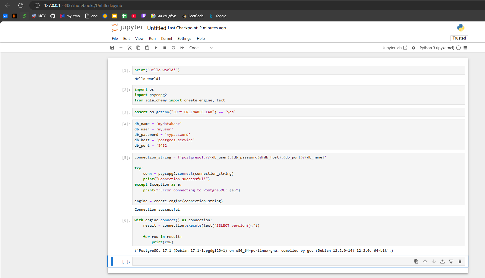

## containerization_orchestration

### Project Overview

This repository contains four laboratory works related to containerization and orchestration, each in a separate branch.

### Branches:

- **Lab 1**: `lab1` [branch lab1 ](https://github.com/alexiv-tn65/containerization_orchestration/tree/lab1)
- **Lab 2**: `lab2` [branch lab2 ](https://github.com/alexiv-tn65/containerization_orchestration/tree/lab2)
- **Lab 3**: `lab3` [branch lab3 ](https://github.com/alexiv-tn65/containerization_orchestration/tree/lab3)
- **Lab 4**: `lab4` [branch lab4 ](https://github.com/alexiv-tn65/containerization_orchestration/tree/lab4)

#### Ход выполнения

1. Запускаем `minikube`

```bash
minikube start
```

2. Собираем кастомный образ `my-jupyter-notebook` на основе инструкций, указанных в Dockerfile, который находится в текущем каталоге (обозначенном точкой .).

```bash
minikube image build -t my-jupyter-notebook .
```

3. Запускаем сервис  
Применение конфигураций в Kubernetes:   

```bash
kubectl apply -f config-map.yaml
kubectl apply -f postgres-secret.yaml
kubectl apply -f postgres-pvc.yaml
kubectl apply -f jupyter-deployment.yaml
kubectl apply -f postgres-deployment.yaml
kubectl apply -f postgres-service.yaml
kubectl apply -f jupyter-service.yaml
```  

Проверка статуса подов:  
kubectl get pods  

Проверка логов подов:   
kubectl logs <имя_пода>  

Проверка конфигураций:    
kubectl get configmaps    
kubectl get secrets   

4. Туннелирование трафика между нодой minikube и upyter-notebook-service, тестирование доступа к сервису:  

```bash
minikube service jupyter-notebook-service --url 
```


## Проверяем статусы   


Проверка логов init-контейнера:    
kubectl logs <имя_пода> -c init-container   


   

Получение списка всех подов с метками:    
kubectl get pods --show-labels    

Получение меток конкретного пода
kubectl get pod <имя_пода> --show-labels


## Проверяем сервис



<!-- ## полный листинк команд для запуска

```bash
minikube start
minikube image build -t my-jupyter-notebook .
kubectl apply -f configmap.yaml
kubectl apply -f secret.yaml
kubectl apply -f init-deployment.yaml
kubectl apply -f postgres-deployment.yaml
kubectl apply -f app-deployment.yaml
kubectl apply -f service.yaml
``` -->

### Описания сервисов

```yaml
# config-map.yaml
# ✅ Использование `ConfigMap`
apiVersion: v1
kind: ConfigMap
metadata:
  name: jupyter-postgres-config
data:
  JUPYTER_ENABLE_LAB: "yes"
```

```yaml
# secrete.yaml
# ✅ Использование `Secret`
apiVersion: v1
kind: Secret
metadata:
  name: postgres-secret
type: Opaque  # тип секрета
data:
  POSTGRES_DB: bXlkYXRhYmFzZQ== # base64
  POSTGRES_USER: bXl1c2Vy # base64
  POSTGRES_PASSWORD: bXlwYXNzd29yZA== # base64
```

```yaml
# jupyter-deployment.yaml
apiVersion: apps/v1
kind: Deployment
metadata:
  name: jupyter-notebook-deployment
  labels: # задаем метки
    app: jupyter-notebook
    tier: frontend # ✅ Использование `labels`
spec:
  replicas: 1 # количество реплик
  selector:
    matchLabels:
      app: jupyter-notebook
  template:
    metadata:
      labels:
        app: jupyter-notebook
        tier: frontend
    spec:
      containers:
      - name: jupyter-notebook
        image: my-jupyter-notebook # имя собранного образа, ✅ Использование кастомного образа (`my-jupyter-notebook`)
        imagePullPolicy: Never # явно указываем, что образ не будет загружаться из реестра
        ports:
        - containerPort: 8888 # порт контейнера
        env: # переменные окружения
        - name: JUPYTER_ENABLE_LAB
          valueFrom:
            configMapKeyRef: # ссылка на конфиг-мап
              name: jupyter-postgres-config # имя конфиг-мап
              key: JUPYTER_ENABLE_LAB # ключ в конфиг-мапе
      initContainers: # контейнер-инициализатор, ✅ Использование `initContainers`
        - name: init-container
          image: alpine:latest # образ для инициализации
          command: ["sh", "-c", "echo 'Initialization complete'"] # команда для инициализации
```

```yaml
# jupyter-service.yaml
# ✅ Использование `Service` для `Deployment`
apiVersion: v1
kind: Service
metadata:
  name: jupyter-notebook-service 
  labels:
    app: jupyter-notebook  
    tier: frontend
spec:
  type: NodePort # тип сервиса (node чтобы можно было обращаться к ноутбуку)
  ports:
  - port: 8888 
    targetPort: 8888 
    nodePort: 30000
  selector:
    app: jupyter-notebook 
```

```yaml
# postgres-deployment.yaml

apiVersion: apps/v1
kind: Deployment
metadata:
  name: postgres-deployment
  labels: # указываем метки
    app: postgres
    tier: database
spec:
  replicas: 1
  selector:
    matchLabels:
      app: postgres
  template:
    metadata:
      labels:
        app: postgres
        tier: database
    spec:
      containers:
      - name: postgres
        image: postgres:latest
        env:
        - name: POSTGRES_DB
          valueFrom:
            secretKeyRef:
              name: postgres-secret
              key: POSTGRES_DB
        - name: POSTGRES_USER
          valueFrom:
            secretKeyRef:
              name: postgres-secret
              key: POSTGRES_USER
        - name: POSTGRES_PASSWORD
          valueFrom:
            secretKeyRef:
              name: postgres-secret
              key: POSTGRES_PASSWORD
        ports:
        - containerPort: 5432
        volumeMounts: # ✅ Использование `volume`
        - mountPath: /var/lib/postgresql/data
          name: postgres-storage
        readinessProbe: # ✅ Использование `readinessProbe`
          exec:
            command:
            - sh
            - -c
            - "PGPASSWORD=$POSTGRES_PASSWORD psql -U $POSTGRES_USER -d $POSTGRES_DB -c 'SELECT 1;'"
          initialDelaySeconds: 5
          periodSeconds: 10

      volumes: # создаем volume
      - name: postgres-storage
        persistentVolumeClaim: # ссылка на PVC
          claimName: postgres-pvc
```

```yaml
# postgres-service.yaml
# ✅ Использование `Service` для `Deployment`
apiVersion: v1
kind: Service
metadata:
  name: postgres-service
  labels:
    app: postgres
    tier: database
spec:
  type: ClusterIP
  ports:
  - port: 5432
    targetPort: 5432
  selector:
    app: postgres
``
